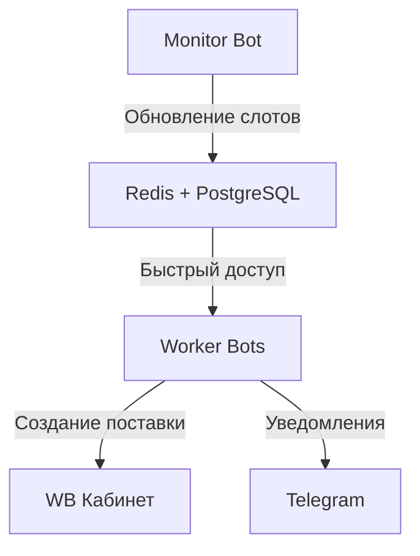
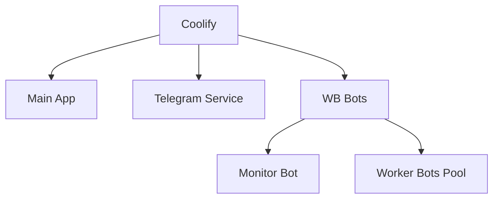
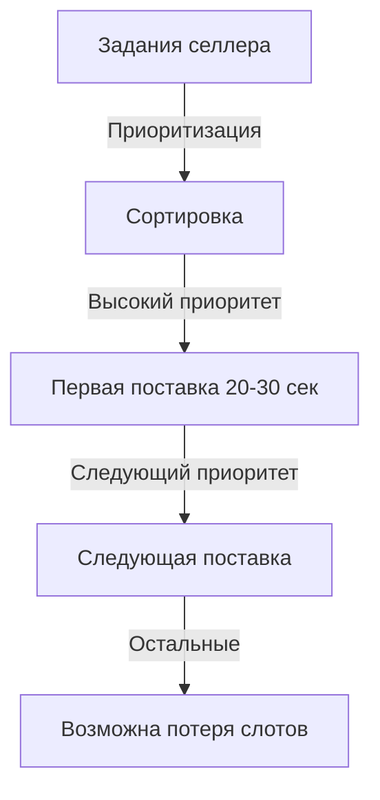
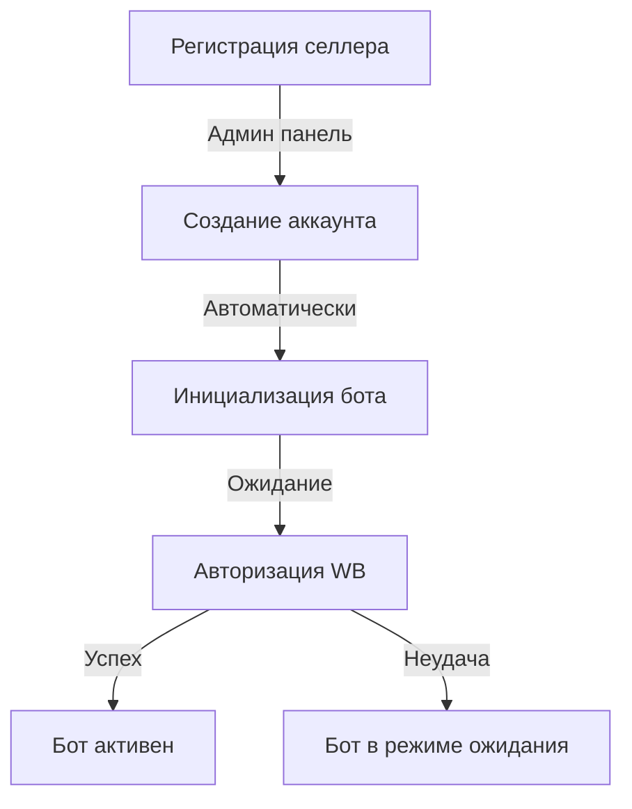
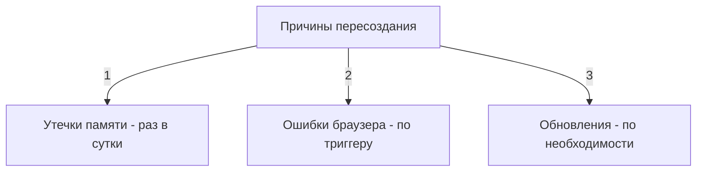
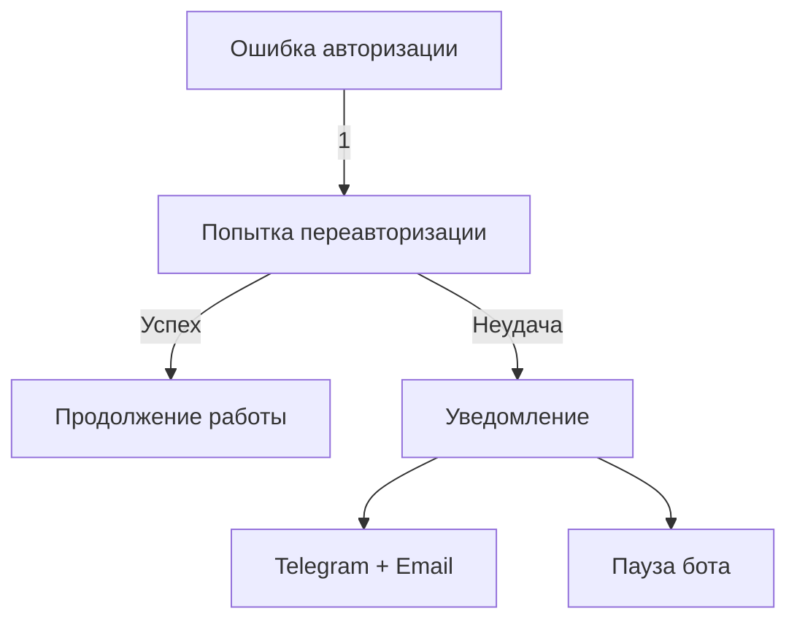
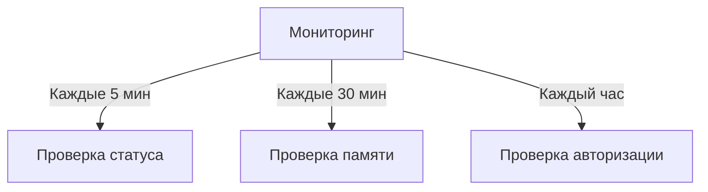

# WB Supply Bot - SaaS Solution

## Архитектура системы

### Основные компоненты
1. **Monitor Bot**
   - Единый бот для мониторинга всех слотов
   - Постоянное обновление базы данных слотов
   - Мониторинг каждые 12 секунд
   - Хранение истории изменений

2. **Worker Bots**
   - Постоянно открытые браузеры для быстрого реагирования
   - Привязка к конкретным заданиям
   - Мгновенная реакция на появление нужного слота
   - Создание поставок за 20-30 секунд

3. **База данных**
   - PostgreSQL для основных данных
   - Redis для кэширования слотов
   - Календарь слотов на 30 дней вперед
   - Ежедневное смещение календаря

### Процессы



### Авторизация пользователей
1. **Первичная авторизация**
   - Через iframe/новое окно в личном кабинете
   - Сохранение cookies/session
   - Подтверждение успешной авторизации

2. **Поддержание сессии**
   - Мониторинг статуса авторизации
   - Уведомления при потере доступа
   - Простое переподключение через ЛК

### Инфраструктура (Coolify)


### Масштабирование
1. **Вертикальное**
   - Увеличение ресурсов сервера
   - Оптимизация использования памяти
   - Балансировка нагрузки

2. **Горизонтальное**
   - Добавление новых пулов ботов
   - Распределение нагрузки между серверами
   - Синхронизация через общую БД

### Мониторинг и поддержка
1. **Мониторинг**
   - Статус ботов
   - Нагрузка на сервер
   - Статистика успешных поставок
   - История ошибок

2. **Уведомления**
   - Telegram сообщения
   - Звонки через Telegram
   - Уведомления в ЛК

### Тарифы и ограничения
- 5 / 10 / 25 / 50 / 100 / 500 поставок в месяц
- Учет использования в реальном времени
- Автоматическая остановка при превышении лимита

/
/
/
/
/
/
/
/

### Worker Bots - Принципы работы

1. **Базовый принцип**
   - 1 селлер = 1 бот (обязательное условие)
   - Уникальная авторизация для каждого бота
   - Постоянно открытый браузер
   - Мгновенная реакция на слоты

2. **Ограничения**
   - Бот обрабатывает только 1 задание за раз
   - Время создания поставки: 20-30 секунд
   - При появлении нескольких слотов - работа по приоритетам



3. **Приоритизация заданий**
   - Дата дедлайна
   - Тариф пользователя
   - Время создания задания
   - Важность склада (если указано)

4. **Оптимизация ресурсов**
   - Headless режим браузера
   - Отключение изображений
   - Периодическая очистка кэша
   - Оптимальное потребление: 150-200MB RAM на бот

### Премиум возможности
1. **Мульти-аккаунт** (опционально)
   - Возможность использовать несколько аккаунтов WB
   - Отдельный бот для каждого аккаунта
   - Увеличение шансов на слоты
   - Требует дополнительной оплаты

2. **Ограничения мульти-аккаунта**
   - Риск блокировки WB
   - Сложность управления
   - Повышенное потребление ресурсов

### Масштабирование системы
1. **Расчет ресурсов на сервер**
   - Основное приложение: 500MB RAM
   - Monitor Bot: 300MB RAM
   - Worker Bot: 200MB RAM × количество селлеров
   - Пример: 10 селлеров = ~3GB RAM

2. **Вертикальное масштабирование**
   - Увеличение RAM сервера
   - Оптимизация использования ресурсов
   - Мониторинг нагрузки

3. **Горизонтальное масштабирование**
   - Распределение ботов по серверам
   - Общая база данных
   - Балансировка нагрузки

### Честность с клиентами
1. **Ограничения системы**
   - Четкое описание возможностей
   - Объяснение принципа работы
   - Предупреждение о возможной потере слотов

2. **Рекомендации клиентам**
   - Распределение заданий по времени
   - Правильная установка приоритетов
   - Использование премиум-возможностей при необходимости

/
/
/
/
/
/
/
/

**Процесс создания и управления ботами:**




**1. При регистрации селлера:**
- Админ создаёт аккаунт
- Система автоматически:
  - Создаёт контейнер для бота
  - Настраивает окружение
  - Готовит браузер

**2. Процесс авторизации:**
- Селлер входит в ЛК
- Нажимает "Подключить WB"
- Логинится в открывшемся окне
- Система сохраняет сессию

**3. Статусы бота:**
```python
BOT_STATUSES = {
    'INITIALIZING': 'Создание бота',
    'WAITING_AUTH': 'Ожидание авторизации',
    'ACTIVE': 'Активен',
    'ERROR': 'Ошибка',
    'STOPPED': 'Остановлен'
}
```

/
/
/
/
/
/
/
/

**1. Пересоздание контейнеров:**


**Рекомендация:**
- Плановое пересоздание: каждые 24 часа в 3-4 утра
- Внеплановое: при ошибках или зависаниях
- Важно: Сохранять cookies между перезапусками

**2. Ошибки авторизации:**


**Действия системы:**
1. Три попытки автоматической переавторизации
2. Если не удалось:
   - Уведомление селлеру
   - Пауза бота
   - Ожидание ручной авторизации

**3. Мониторинг ботов:**


**Метрики для отслеживания:**
1. Статус бота (активен/неактивен)
2. Использование памяти
3. Статус авторизации
4. Количество успешных поставок
5. Ошибки и сбои

**Действия при проблемах:**
1. Автоматическое восстановление где возможно
2. Уведомления админу и селлеру
3. Логирование всех событий

